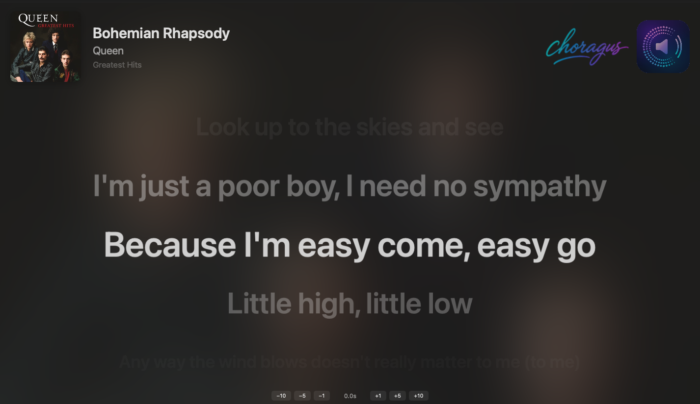
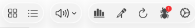
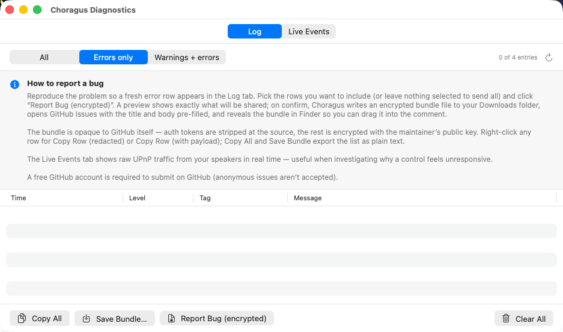

# Choragus

**Native macOS controller for Sonos speakers.** Built entirely in Swift and SwiftUI. Ships as a universal binary with native support for both Apple Silicon and Intel Macs.

> Choragus was previously named *SonosController*. Same project, same code; renamed in respect of the Sonos trademark.

> **Looking for internals?** See [technical_readme.md](technical_readme.md) for architecture, protocols, and build instructions.


---

## Why This Exists

Sonos shipped a macOS desktop controller for years, but it was an Intel-only (x86_64) binary that relied on Apple's Rosetta 2 translation layer. Apple is discontinuing Rosetta, which means the official Sonos desktop app will stop working on modern Macs — and Sonos appears to have no plans to release a native replacement.

This project was built from scratch by a Sonos fan who wanted to keep controlling their speakers from their Mac. It is not affiliated with, endorsed by, or derived from Sonos, Inc. in any way. No proprietary Sonos code, assets, or intellectual property were used. The app communicates with speakers using the open UPnP protocols that any device on your local network can see and use. All control happens locally — nothing is sent to the cloud.

Tested against a live Sonos system with 16 speakers across 10 zones, a large local music library (45,000+ tracks), and multiple streaming services (Apple Music, Spotify, TuneIn, Calm Radio, Sonos Radio).

---

## Installing on macOS

1. From the [latest release](https://github.com/scottwaters/Choragus/releases/latest), download `Choragus.dmg` and double-click it.
2. Drag `Choragus.app` into the Applications folder shown in the mounted window.
3. Eject the disk image, then launch Choragus from `/Applications`.

The DMG is signed with a Developer ID and notarized by Apple, so it launches cleanly with no Gatekeeper warning. On first launch macOS will ask for permission to access devices on your local network — grant it, or speaker discovery will not work.

> **Upgrading from v4.5?** Please install v4.6 manually once via the steps above. The in-app auto-update from v4.5 won't work because of an entitlements gap baked into the v4.5 binary; v4.6 ships the fix, but the fix only takes effect once v4.6 is installed. From v4.6 onward, all updates install themselves automatically.

## Setting Up Music Services

Once the app is installed, getting your streaming services (Spotify, Plex, TuneIn, Apple Music, etc.) to show up takes either one click or three steps depending on the service. For step-by-step instructions written for non-technical users, see **[Setupguide.md](Setupguide.md)**.

Short version:

- **TuneIn / Calm Radio / Sonos Radio / Apple Music search** — these services need to exist in your Sonos household first (radio services are usually pre-installed; Apple Music has to be added in the Sonos app). Then in Choragus press `⌘,`, scroll to **Music**, tick the checkbox. If a service isn't set up in Sonos, the toggle is disabled with an inline hint.
- **Spotify / Plex / Apple Music playback** — first add the service in the official Sonos app, then *(Spotify and Apple Music only)* play one song from it and save it as a Sonos Favorite, then come back to Choragus, press `⌘,`, **Music → Connected Services → Connect**, and sign in via the browser.

Why the favourited-song step? Sonos generates an internal account identifier the first time you save content from a service. Without it, no third-party app can authenticate playback through that service. It is a Sonos design constraint, not a Choragus limitation. The full explanation is in [Setupguide.md](Setupguide.md).

---

## What's New in v4.6

- **Standard DMG installer.** Choragus now ships as a signed `.dmg` with the usual drag-to-Applications layout.
- **In-app updates work.** Check for Updates → installs and relaunches automatically from v4.6 onward (see the upgrade note above for the one-time manual install needed if you're on v4.5).
- **Spotify and Apple Music: "Add All" on an artist's album list now adds every album.** Same fix covers Plex playlist lists.
- **Spotify playback fix** for accounts (often outside the US) where clicking a single song would error instead of playing.
- **Plex local tracks show their actual length and a working seek bar** in Now Playing.
- **±15 s and ±30 s seek buttons** added to Now Playing for quick scrubbing within a track.
- **Settings opens as a proper Preferences window** (⌘,) instead of blocking the rest of the app.

Full change list in [CHANGELOG.md](CHANGELOG.md).

---

## What's New in v4.5

A polished karaoke experience, automatic updates, encrypted bug reporting, and substantial under-the-hood performance work.

### Features

- **Karaoke window, much improved** — open it from the **microphone icon (🎤) in the main window toolbar**, or **Window → Pop Out Karaoke Lyrics (⌘K)**. It opens in its own resizable window with karaoke-style text readable from across the room. Album art and the blurred backdrop crossfade smoothly between tracks instead of snapping. On radio stations, the previous song's art now stays on screen during the brief metadata-loading gap between tracks — no more flicker back to the station logo when a new song starts. Stays locked to the room you opened it for so it doesn't get yanked away when you click around the main UI.

  

  **Karaoke party setup** — get the karaoke window onto a big screen one of two ways:

  - **Wirelessly via AirPlay** to any AirPlay-compatible display (Apple TV, an AirPlay-receiving smart TV, or another Mac running macOS Sonoma or later). System Settings → Displays → "Add Display" → pick the receiver → "Use as separate display".
  - **Wired directly** with an HDMI / USB-C / Thunderbolt cable from your Mac to a TV or external monitor — zero latency, no Wi-Fi dependency. The TV / monitor appears as a regular extended display under System Settings → Displays the moment you plug in.

  Either way, drag the karaoke window onto that screen and hit ⌃⌘F for fullscreen. Music plays through your Sonos speakers as normal; the lyrics show on the external display. From there, you can control everything from your phone using the regular Sonos app — skip, queue, pause, regroup rooms — and the lyrics update automatically as the song changes. The Mac just needs to stay awake and signed in. If the lyrics drift behind the music by a fraction of a second (AirPlay video has ~100–200 ms latency over the wireless path; the wired path is essentially zero), nudge them back into sync once with the offset chips at the bottom of the karaoke window; the offset is remembered per track.

- **Automatic updates** — Choragus now checks for and installs new releases on its own. A new **Software Updates** tab in Settings has toggles for automatic checking and downloading, a manual "Check Now" button, and an opt-in **Beta Channel** for early access to in-progress releases (with a clear warning that beta builds may be unstable). Updates are cryptographically signed and verified before install — a tampered or impersonated update is rejected.

  

- **Encrypted bug reporting** — the Diagnostics window has a new "Report Bug (encrypted)" button. Click it → a preview shows you exactly what's being shared (with redaction markers visible) → confirm, and Choragus writes a `.choragus-bundle` file to your Downloads folder, opens GitHub Issues with the title and body pre-filled, and reveals the bundle in Finder so you can drag it into the comment. The bundle is opaque to GitHub and to anyone but the maintainer — auth tokens are stripped at the source, then the rest is encrypted with the maintainer's public key. A new **Live Events** tab in the same window shows the raw UPnP traffic from your speakers in real time, useful when troubleshooting why a control feels unresponsive.

  


- **Heavy code and functional optimisation** — substantial work under the hood to reduce idle CPU churn, eliminate background log floods that were both slowing things down and saturating the diagnostic store, and tighten the SwiftUI invalidation surface so playback and lyric scrolling feel noticeably smoother across the board.

- **Smaller things** — window state (open panels, size, position, Browse-panel width) carries across launches; About card falls back to iTunes for artist photos when Last.fm doesn't have one.

### Fixes

- **Mute, volume, and group state update instantly across grouped speakers** — substantial internal rework of how Choragus mirrors speaker state. Previously, a change made from the Sonos app to a grouped speaker (especially a portable Float in a group with a wired coordinator) could take 10+ seconds to surface in the Choragus UI: the coordinator would update immediately, the member would lag, occasionally appearing to flip between states until unrelated events caught up. The UI now reads directly from the authoritative source instead of maintaining a derived local mirror — both faster and more correct, with a side benefit of less idle CPU churn.
- **Browse paginates properly for streaming services** — Spotify, Plex Cloud, and Audible browse now fetch beyond the first ~100 items via infinite scroll. Previously "Load More" silently returned nothing for any SMAPI-backed service because the wrong protocol was being asked for the next page. Local-library + UPnP browse paginates the same way. Quick scrolls no longer fire duplicate concurrent loads.
- **Full Last.fm bios** — the About card was previously showing only Last.fm's truncated one-paragraph summary for famous artists. It now shows the full biography. If you've already looked at an artist, hit the right-click "Refresh metadata" once to drop the old short version from the cache.
- **Settings checkboxes are responsive again** — toggling Ignore TV/HDMI Line-In, Realtime dashboard summaries, Classic Shuffle, etc. now updates instantly instead of feeling stuck for a second after click.
- **No more "Adding to queue" green banners** — the transient banner that appeared whenever you added tracks to the queue is gone. The queue panel's own spinner is the in-progress signal.
- **Music Services list no longer duplicates** — Pandora and other pinned services no longer show up twice when your Sonos household lists them under a different internal ID.
- **Album art stays in sync on radio** — fixed two long-standing radio-art bugs: Now Playing showing the previous song's cover briefly after a station rolled to the next track (now keyed to the current title), and the menubar showing the previous song's cover for the same reason (radio URIs no longer poison the art cache).
- **Local library files with spaces** — files in folders with spaces in their path (e.g. `Pink Floyd/`) now reliably add to the queue. Previously they were silently rejected past the first track when adding multiples.
- **iTunes search prioritises UI over background work** — the artwork search backend now lets user-initiated lookups (Now Playing, Browse, manual refresh, artist photo) skip past the local rate cap that background art-backfill uses. Result: opening an album in Browse no longer waits for the post-launch backfill pass to drain.

For the full per-feature change list with technical details, see [CHANGELOG.md](CHANGELOG.md).

For older releases (v4.0, v3.x, v2.x, v1.0), see [CHANGELOG.md](CHANGELOG.md) — the full, dated history.

> **Upgrading from SonosController?** v4.0 was a major rework — the project was renamed, the bundle identifier changed, and the place macOS keeps your saved logins moved with it. Existing SonosController installs do not auto-upgrade; download Choragus as a fresh app and re-authenticate any connected music services on first launch. Play history, presets, stats, and preferences carry over automatically. The full upgrade note is in [CHANGELOG.md](CHANGELOG.md#v40--2026-04-27--choragus).

---

## Features

### Now Playing, Browse, and Queue

The main view shows three panels: **Browse** (left), **Now Playing** (centre), and **Queue** (right). All three are togglable from the toolbar. The Now Playing panel is guaranteed a minimum width of 640 px — the side panels shrink proportionally when the window is resized.

**Now Playing** shows album art with automatic artwork resolution from multiple sources (speaker metadata, iTunes Search, manual override). Right-click the artwork to search for alternative art, ignore incorrect art, or refresh. The service tag (Spotify, Radio, Music Library, etc.) shows the source at a glance.

**Star any track** — click the star icon next to Copy Track Info to star the currently playing track. Works for any source: queue tracks, radio streams, Spotify, Apple Music — any track where metadata is available. Starred tracks are saved locally and can be filtered in the listening history. Star and unstar from Now Playing or the menu-bar mini player.

**Copy Track Details** copies the current track's metadata to the clipboard in a clean format:

```
Artist: Lofi Girl
Album: Lofi Girl x Assassin's Creed Shadows - stealthy beats to relax to
Track: A Moment of Sweetness - Prithvi Remix
```

Useful for sharing, logging, or searching another platform.

**Playback controls** — play, pause, stop, skip, seek with a draggable slider and smooth position interpolation. Shuffle, repeat (off / all / one), crossfade, sleep timer. Pause-all / Resume-all from the toolbar menu.

**Volume** — master slider covers the whole group (proportional or linear mode). Individual per-speaker sliders with drag protection. Mute toggle per speaker and master. Bass, treble, loudness, and Home Theater EQ (sub/surround levels, night mode, dialog enhancement) via the EQ panel.

**Scroll-wheel + middle-click** *(v3.6)* — hover over the Now Playing view and scroll the mouse wheel to adjust the master volume of the selected speaker. Middle-click anywhere on the view toggles mute. Discrete steps, debounced so rapid flicks don't spam the speaker with SOAP calls.

### Browse & Library

The Browse panel provides access to your entire music library and connected services:

- **Service Search** — Apple Music, TuneIn, Calm Radio, Sonos Radio, Spotify (individually toggleable in Settings)
- **Sonos Favorites & Playlists** — everything you've set up in the Sonos app
- **Local Library** — NAS/network music library with artists, albums, tracks, genres, composers, folder browsing
- **Recently Played** — quick access to tracks from your listening history
- **Search** — local library search across artists, albums, and tracks
- Play now, play next, add to queue, replace queue from the context menu
- Drag tracks from Browse directly into the Queue

### Queue

The Queue panel shows the current play queue with album art, track info, and duration. Tap to jump to a track, drag to reorder, right-click to remove. Queue shuffle physically reorders the tracks. Save the current queue as a Sonos playlist.

### Music Services


Services are managed in **Settings → Music**. Each can be individually enabled. **First-time setup is described in plain language in [Setupguide.md](Setupguide.md)** — start there if you're not sure how to get a service showing up.

#### Available — No Connection Required

| Service | Browse | Search | Playback | Notes |
|---------|:------:|:------:|:--------:|-------|
| **Local Music Library** | ✓ | ✓ | ✓ | NAS / network shares via UPnP |
| **Sonos Favorites** | ✓ | — | ✓ | Favorites set up in the Sonos app |
| **Sonos Playlists** | ✓ | — | ✓ | Playlists saved from queues |
| **TuneIn** | ✓ | ✓ | ✓ | Public RadioTime API, no login needed |
| **Calm Radio** | ✓ | — | ✓ | Public API, no login needed |
| **Apple Music** | — | ✓ | ✓ | Search via iTunes API. Playback requires Apple Music connected in the Sonos app and one favorited song — this lets the app discover your account credentials. Once set up, all search results are directly playable |
| **Sonos Radio** | — | ✓ | ✓ | Search via anonymous SMAPI. Category browsing requires DeviceLink auth (not yet supported) |

#### Available — Connection Required (Tested)

| Service | Browse | Search | Playback | Notes |
|---------|:------:|:------:|:--------:|-------|
| **Spotify** | ✓ | ✓ | ✓ | AppLink authentication. Connect in Settings, then add one favorited song via the Sonos app |
| **Plex** *(v3.7)* | ✓ | ✓ | ✓ | AppLink authentication via [app.plex.tv/auth](https://app.plex.tv/auth). Streams from your own Plex Media Server — no third-party CDN, no short-lived signatures |
| **Audible** *(v4.0)* | ✓ | ✓ | ✓ | AppLink authentication. Confirmed working for audiobook playback; chapter navigation behaves like a queue |

#### Available — Connection Required (Untested)

40+ additional services are available via SMAPI AppLink/DeviceLink and may work — connect via **Settings → Music → Other Services**. Results are not guaranteed.

| Service | SID | Notes |
|---------|:---:|-------|
| **Pandora** *(v4.0)* | 3 | US-only as of 2026; visible in Settings → Music as untested. Uses the public SMAPI sid 3 (distinct from RINCON 519). Connect at your own risk and please [open an issue](https://github.com/scottwaters/Choragus/issues) with the result |

#### Not Available

Confirmed by live probe against the Sonos `ListAvailableServices` + `getAppLink` endpoints (2026-04-24). These services ship encrypted API keys in their Sonos manifest (`cf.ws.sonos.com/p/m/<uuid>`) that only Sonos's app and speaker firmware can decrypt — third-party clients receive `403 / NOT_AUTHORIZED` from the SMAPI endpoint before auth can begin.

| Service | SID | Response | Workaround |
|---------|:---:|----------|------------|
| **Apple Music** (as SMAPI service) | 204 | `SonosError 999` | iTunes Search API fallback already used for search |
| **Amazon Music** | 201 | Same class of Sonos-identity gate | — |
| **YouTube Music** | 284 | GCP `403 PERMISSION_DENIED` (no API key) | — |
| **SoundCloud** | 160 | `Client.NOT_AUTHORIZED` (403) | Scrobbling of SoundCloud listens via the Sonos app works |
| **Sonos Radio browsing** | 303 | Category browsing requires DeviceLink (search works) | — |

**Scrobbling remains possible for all services above** — play history is recorded from whatever the Sonos app plays, regardless of whether this app can directly browse/search that service.

### Listening History


The **Dashboard** shows your listening patterns at a glance: total plays, hours listened, unique artists and rooms. Quick stat pills show your current streak, best streak, average plays per day, unique albums, stations, and starred-track count. Charts show listening activity over time, peak hours, and day-of-week distribution.


The **History** timeline groups tracks by day with album art, artist, album, service-source badge, room, and duration. Starred tracks show a star icon. Tracks from radio streams show the station name and service badge (Sonos Radio, TuneIn, etc.). Filter by date range, room, source, or search text. Starred-only filter shows just your favourites.


**Right-click any track** in the history to:

- **Star / Unstar** — mark tracks as favourites
- **Copy Track Details** — copies formatted metadata (Artist, Album, Track, Station) to clipboard
- **Copy Title / Copy Artist** — copy individual fields
- **Filter by artist, room, or source** — instantly filter the history view

**Last.fm scrobbling** *(v3.6)* — listening history doubles as the source for Last.fm scrobbling. Everything is submitted from the local SQLite table, not by tapping the speakers again; filter by room and music service so you can (for example) scrobble only what plays in the office, excluding the kids' bedroom. See the **Scrobbling** tab in Settings — fully documented in [What's New in v3.6](#whats-new-in-v36) above.

### Menu Bar Mode


Control playback without switching apps. The menu-bar mini player shows album art with a blurred background, track title, artist, and room. Transport controls (skip, play/pause, skip), volume slider with mute toggle, and a star button for the currently playing track. The room picker shows green/grey dots for playing status across zones. Click *Open Choragus* to bring up the main window.

### Speaker Presets


Save and recall speaker-group configurations with per-speaker volumes. Optionally include EQ settings (bass, treble, loudness, home-theatre sub/surround levels). One-click Apply to instantly reconfigure your speakers. Presets show an `EQ` badge when EQ is bundled and a `5.1` badge when the saved zone is a Home Theater bundle.


The preset editor shows all EQ controls including Home Theater settings: Night Mode, Dialog Enhancement, Sub level, Surround level, TV/Music balance, and Full/Ambient playback mode.

### Settings

Settings has four tabs: **Display**, **Music**, **Scrobbling**, and **System**. Each tab is broken into clearly labelled sections.


- **Display** — Language (13 supported), Theme (System / Light / Dark), Colours (separate pickers for accent dot, playing-zone indicator, and inactive-zone indicator), Menu Bar Controls toggle, Mouse Controls (scroll-wheel volume, middle-click mute).
- **Music** — Connected services with status dots, search-only services as toggles, and the *Other Services (83 available)* section for everything else. *(See screenshot under [Music Services](#music-services).)*
- **Scrobbling** *(v3.6)* — Send your listens to Last.fm using your own API key (register at [last.fm/api/account/create](https://www.last.fm/api/account/create)). Filter by room and by service, run automatically every 5 minutes or on demand. A Filter Preview shows exactly why a track did or didn't scrobble.


- **System** — Updates (Event-Driven push or Legacy Polling), Startup mode (Quick Start cached / Classic), **Discovery** (Auto / Bonjour / Legacy Multicast — Auto is the default and works for almost everyone), and the artwork Cache controls (max size, max age, clear).

### Privacy & Local-Only Operation

- **No accounts, no cloud.** The app talks directly to your speakers on your LAN.
- **No telemetry.** No analytics, no crash reporting, no usage tracking.
- **Tokens stay in Keychain.** When you connect a service like Spotify, the auth tokens live in macOS Keychain, protected so they can't be copied to another device.
- **App sandbox.** The app runs with minimal entitlements — network only. It can't read your files, contacts, or other apps.
- **All history stays on your Mac.** Listening history is a local SQLite file. You can clear it at any time from Settings.

---

## Requirements

- macOS 14.0 (Sonoma) or later
- Apple Silicon Mac (M1+) or Intel Mac
- Sonos speakers on the same local network

## Installation

See [Installing on macOS](#installing-on-macos) above — one short list, signed and notarized, opens cleanly on first launch.

Building from source? See [technical_readme.md](technical_readme.md#building-from-source).

---

## Forking & home builds

A few features in the upstream binary depend on credentials and infrastructure that aren't included in the source. Self-built copies still work — those features simply stay inert or fall back. See **[docs/FORKS.md](docs/FORKS.md)** for what's affected and how to substitute your own.

---

## Known Limitations

- **Apple Music** — search works via the iTunes API; playback requires Apple Music connected in the Sonos app plus one favorited song.
- **Sonos Radio** — search works anonymously; browsing categories requires DeviceLink auth (not yet supported).
- **Amazon Music / YouTube Music** — blocked (they require native OAuth flows that aren't available to third-party apps).
- **Adding to Favorites** — requires the official Sonos app (the UPnP `CreateObject` action is not supported by Sonos firmware).
- **Alarms** — Sonos S2 uses a cloud API; the local UPnP `AlarmClock` service returns empty.

## License

PolyForm Noncommercial 1.0.0 — see [LICENSE](LICENSE). Copyright © 2024-2026 Choragus contributors. Free for personal, hobbyist, educational, charitable, and other noncommercial use; commercial use requires a separate agreement. These terms apply retroactively to every version of the software ever released under any name — including all releases previously distributed as **SonosController** (the project's former name). Any prior MIT-licensed SonosController or Choragus releases are superseded.

## Disclaimer

This project is not affiliated with, endorsed by, or connected to Sonos, Inc. or any of the music service providers referenced in this software. All trademarks are the property of their respective owners: "Sonos" and "Sonos Radio" are trademarks of Sonos, Inc.; "Spotify" is a trademark of Spotify AB; "Apple Music" and "iTunes" are trademarks of Apple Inc.; "Amazon Music" is a trademark of Amazon.com, Inc.; "YouTube Music" is a trademark of Google LLC; "TuneIn" is a trademark of TuneIn, Inc.; "TIDAL" is a trademark of Aspiro AB; "Deezer" is a trademark of Deezer SA; "SoundCloud" is a trademark of SoundCloud Limited; "iHeartRadio" is a trademark of iHeartMedia, Inc.; "Plex" is a trademark of Plex, Inc.; "Calm Radio" is a trademark of Calm Radio Ltd.

This software is an independent, fan-built controller that communicates with Sonos hardware using standard UPnP protocols. No proprietary code, assets, or intellectual property from any of these companies was used. Use at your own risk.
