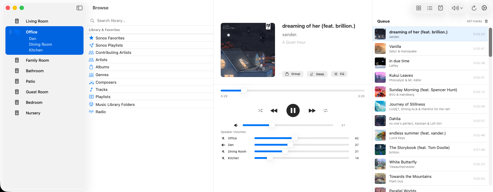

# SonosController

A native macOS controller for Sonos speakers, built entirely in Swift and SwiftUI for Apple Silicon.



## Why This Exists

Sonos shipped a macOS desktop controller for years, but it was an Intel-only (x86_64) binary that relied on Apple's Rosetta 2 translation layer. Apple is discontinuing Rosetta, which means the official Sonos desktop app will stop working on modern Macs — and Sonos appears to have no plans to release a native replacement.

This project was built from scratch by a Sonos fan from the beginning who wanted to keep controlling their speakers from their Mac.  I usually use the phone app but I sit in front of my workstation most days and use the desktop app many times during those days for my office speakers.  I also added a few tweaks/features that always bugged me or I thought were missing (but I added settings options to revert to original behaviour if you have problems :) ).

It is not affiliated with, endorsed by, or derived from Sonos, Inc. in any way. No proprietary Sonos code, assets, or intellectual property were used. The app communicates with Sonos speakers using the same open UPnP/SOAP protocols that any device on your local network can see and use (the same the other fan built implementations also use).

## Built With AI

This application — every line of code, every view, every protocol implementation — was built in a single session interactively with [Claude Code](https://claude.ai/). The project went from an empty directory to a fully functional Sonos controller in approximately 4 hours of collaborative development in an afternoon.

The directed AI handled architecture decisions, Swift/SwiftUI implementation, UPnP protocol research, XML parsing, network discovery, UI design, debugging, and iterative refinement based on real-world testing against a live Sonos system with 16 active speakers.

## Features

### Playback Control
- Play, pause, stop, skip forward/back
- Seek within tracks
- Shuffle and repeat (off / all / one)
- Keyboard shortcut: spacebar for play/pause
- Optimistic UI — controls respond instantly with a grace period system that prevents polling from reverting your action while the speaker processes it

### Now Playing
- Album art display with two-tier disk and memory caching
- Track title, artist, album — clears to "No Track" when nothing is playing
- Draggable seek slider with smooth interpolation (no 2-second jumps)
- Freeze period after play/seek prevents slider bounce while speaker buffers

### Volume
- **Single speaker** — direct volume slider and mute
- **Grouped speakers** — master slider adjusts all speakers proportionally, preserving relative balance. Master mute controls all speakers.
- Individual per-speaker volume sliders and mute buttons below the master
- Animated slider transitions when volumes change
- Delayed spinner indicators — only appear if a volume change takes more than 300ms
- Bass, treble, and loudness controls (EQ panel per speaker)
- Mute/Unmute all speakers globally (toolbar menu)

### Speaker Management
- Automatic SSDP discovery of all Sonos speakers on your network
- Zone grouping — add or remove speakers from groups with optimistic UI
- Group All / Ungroup All buttons for quick whole-house control
- Speakers already in another group are labelled in the group editor
- Coordinator speaker always listed first, others alphabetically
- Bonded speakers (soundbar + sub + surrounds) shown as a single room
- Invisible/satellite speakers filtered from the UI
- Sound wave indicators in sidebar show which rooms are currently playing

### Browse & Library
- **Sonos Favorites** — play any saved favorite including radio stations, Spotify playlists, Apple Music content
- **Music Library** — browse your local network music shares (NAS/server) by folder, all the way down to individual tracks
- **Artists, Albums, Genres, Composers, Tracks** — full indexed library browsing with drill-down navigation
- **Sonos Playlists** and imported playlists
- **Search** across artists, albums, and tracks
- All browse sections dynamically discovered from your Sonos system (nothing hardcoded)
- Play now, play next, or add to queue from any browse result via right-click context menu
- Pagination for large libraries (tested with 45,000+ tracks, 6,500+ albums)

### Queue
- View the current play queue with album art
- Tap to jump to any track
- Remove individual tracks or clear the entire queue
- Drag to reorder

### Alarms
- View all configured Sonos alarms
- Enable/disable individual alarms
- Delete alarms

### Sleep Timer
- Set from preset durations (15m, 30m, 45m, 1h, 2h)
- View remaining time
- Cancel active timer

### Caching & Performance
- **Quick Start mode** — caches your speaker layout and browse menu locally. On subsequent launches, the UI appears instantly from cache while speakers are verified in the background. If anything changed, the UI updates automatically. Stale data is detected gracefully with user-visible notifications.
- **Classic mode** — waits for live network discovery before showing speakers (always current, slightly slower startup).
- **Album art cache** — two-tier caching (memory + disk) for album artwork. Images load instantly on repeat views. JPEG compressed with configurable max size (100 MB–5 GB) and max age (7 days–never). LRU eviction.
- **Grace period system** — after pressing play/pause or changing volume, the UI holds your intended state for 5 seconds so polling doesn't snap it back while the speaker processes the command.
- **Smooth progress interpolation** — the seek bar advances locally every 0.5s between 2-second server polls, with drift correction. Never jumps backward on small drift.
- Configurable via Settings (gear icon in toolbar).

### Music Services
- Streaming services (Spotify, Apple Music, TuneIn, etc.) use Sonos's proprietary SMAPI protocol and are not directly browsable from this app
- Content from these services is playable through **Sonos Favorites** — add favorites via the Sonos mobile app, then play them from the Favorites section in Browse
- Favorites that require the Sonos mobile app to resolve (e.g. artist shortcuts, Sonos Radio links) are clearly marked as such

## Requirements

- macOS 14.0 (Sonoma) or later
- Apple Silicon Mac (M1 or later) — also runs on Intel via Rosetta during the transition period
- Sonos speakers on the same local network

## Installation

### Option 1: Download Pre-Built App

1. Go to [Releases](../../releases) and download the latest `SonosController.zip`
2. Unzip and drag `SonosController.app` to your Applications folder
3. **First launch:** Right-click the app and click "Open", then click "Open" in the dialog (required once because the app is not notarized with Apple — it's a community project, not from the App Store)
4. macOS will ask to allow local network access — click Allow (the app needs this to find your Sonos speakers)

### Option 2: Build From Source

**Prerequisites:** Xcode 15 or later (free from the Mac App Store). No other tools or dependencies needed.

```bash
# Clone the repo
git clone https://github.com/yourname/SonosController.git
cd SonosController

# Build (Release, Apple Silicon)
xcodebuild -project SonosController.xcodeproj \
  -scheme SonosController \
  -configuration Release \
  -arch arm64 \
  build

# The built app is at:
# ~/Library/Developer/Xcode/DerivedData/SonosController-*/Build/Products/Release/SonosController.app
```

Or open `SonosController.xcodeproj` in Xcode and press Cmd+R to build and run.

**No external dependencies.** No CocoaPods, no SPM remote packages, no downloads. The entire project builds using only Apple's standard frameworks (SwiftUI, Foundation, Darwin).

### Building a Release ZIP for Distribution

```bash
# Build Release
xcodebuild -project SonosController.xcodeproj \
  -scheme SonosController \
  -configuration Release \
  -arch arm64 \
  build

# Find and zip the app
APP_PATH=$(find ~/Library/Developer/Xcode/DerivedData/SonosController-* \
  -name "SonosController.app" -path "*/Release/*" | head -1)
cd "$(dirname "$APP_PATH")"
zip -r ~/Desktop/SonosController.zip SonosController.app
```

The resulting `SonosController.zip` can be uploaded to GitHub Releases.

## Architecture

The project is split into two targets:

- **SonosController** — SwiftUI app with 12 view files
- **SonosKit** — local Swift package containing all networking, protocols, models, and caching (zero external dependencies)

See [docs/ARCHITECTURE.md](docs/ARCHITECTURE.md) for detailed source documentation.

### Protocol Stack (all implemented from scratch)

| Protocol | Purpose |
|----------|---------|
| SSDP | UDP multicast discovery of speakers on the LAN |
| UPnP/SOAP | HTTP+XML commands to speakers on port 1400 |
| DIDL-Lite | XML metadata format for tracks, albums, playlists |
| Sonos UPnP extensions | Zone topology, favorites, service account URIs |

### Sonos Services Used

| Service | What It Controls |
|---------|-----------------|
| AVTransport | Play, pause, stop, seek, sleep timer, grouping |
| RenderingControl | Volume, mute, bass, treble, loudness |
| ZoneGroupTopology | Room/group/coordinator discovery |
| ContentDirectory | Queue, browse library, search, add to queue |
| AlarmClock | List, create, update, delete alarms |
| MusicServices | List available streaming services |

## How It Works

All communication happens on your local network. The app never contacts the internet.

1. **Discovery** — sends a UDP multicast M-SEARCH packet to `239.255.255.250:1900` asking for Sonos ZonePlayers. Each speaker responds with its IP address.
2. **Device description** — fetches XML from each speaker to learn its name, model, and UUID.
3. **Zone topology** — a single SOAP call to any speaker returns the complete map of all rooms, groups, and which speaker is the coordinator of each group.
4. **Commands** — all playback, volume, and browse operations are SOAP (HTTP POST with XML) to port 1400 on the relevant speaker. Transport commands go to the group coordinator; volume commands go to individual speakers.
5. **Polling** — the app polls the selected speaker every 2 seconds for transport state, track position, and volume. A grace period system prevents polling from overwriting optimistic UI state after user actions.
6. **Caching** — speaker topology and browse sections are cached to disk (JSON) for instant startup. Album artwork is cached to a two-tier memory + disk cache with LRU eviction.

## Limitations

- **Music service browsing** — Spotify, Apple Music, and other streaming services use Sonos's proprietary SMAPI protocol which requires OAuth authentication. Only the official Sonos mobile app can configure service accounts. Content from these services is accessible through Sonos Favorites.
- **Radio** — TuneIn and other radio services are SMAPI-based. Radio stations saved as Sonos Favorites play correctly; browsing the radio directory is not supported.
- **No UPnP eventing** — the app uses polling rather than UPnP event subscriptions for state updates. This means a 1-2 second delay for externally-triggered changes (e.g., someone else changes the volume via the Sonos mobile app).

## License

MIT License

Copyright (c) 2026

Permission is hereby granted, free of charge, to any person obtaining a copy
of this software and associated documentation files (the "Software"), to deal
in the Software without restriction, including without limitation the rights
to use, copy, modify, merge, publish, distribute, sublicense, and/or sell
copies of the Software, and to permit persons to whom the Software is
furnished to do so, subject to the following conditions:

The above copyright notice and this permission notice shall be included in all
copies or substantial portions of the Software.

THE SOFTWARE IS PROVIDED "AS IS", WITHOUT WARRANTY OF ANY KIND, EXPRESS OR
IMPLIED, INCLUDING BUT NOT LIMITED TO THE WARRANTIES OF MERCHANTABILITY,
FITNESS FOR A PARTICULAR PURPOSE AND NONINFRINGEMENT. IN NO EVENT SHALL THE
AUTHORS OR COPYRIGHT HOLDERS BE LIABLE FOR ANY CLAIM, DAMAGES OR OTHER
LIABILITY, WHETHER IN AN ACTION OF CONTRACT, TORT OR OTHERWISE, ARISING FROM,
OUT OF OR IN CONNECTION WITH THE SOFTWARE OR THE USE OR OTHER DEALINGS IN THE
SOFTWARE.

## Disclaimer

This project is not affiliated with, endorsed by, or connected to Sonos, Inc. "Sonos" is a trademark of Sonos, Inc. This software is an independent, fan-built controller that communicates with Sonos hardware using standard UPnP protocols. Use at your own risk.
