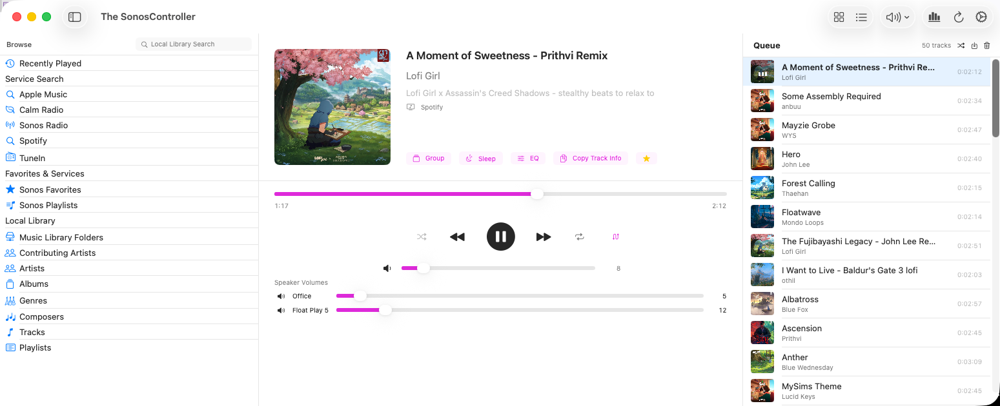
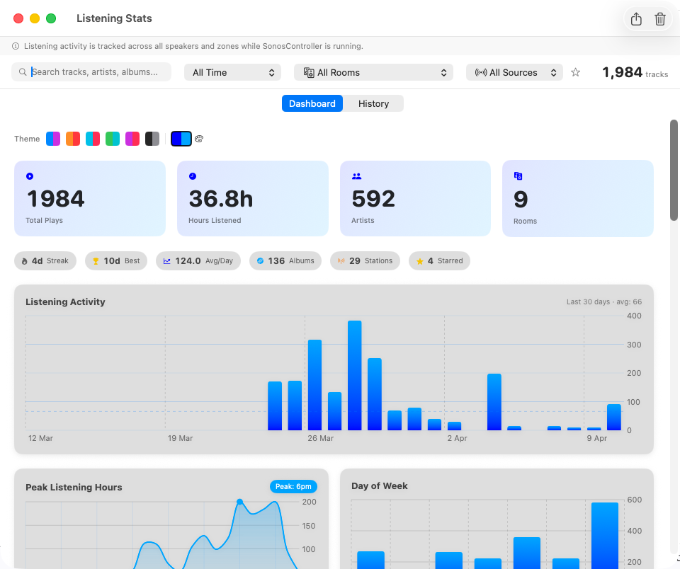
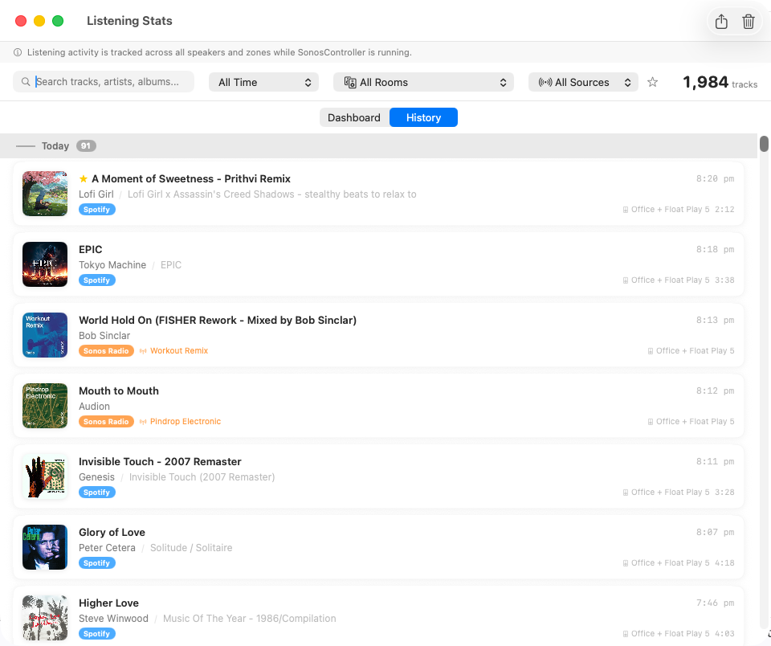
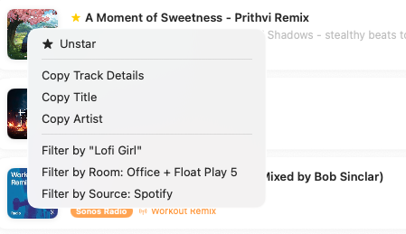
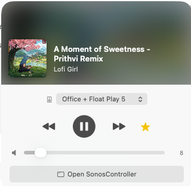
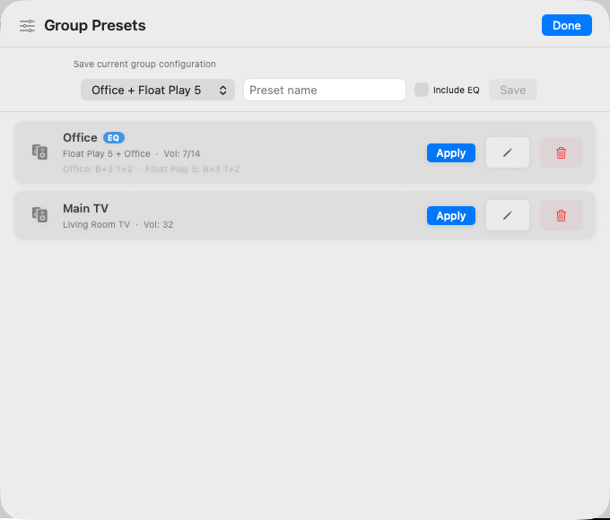
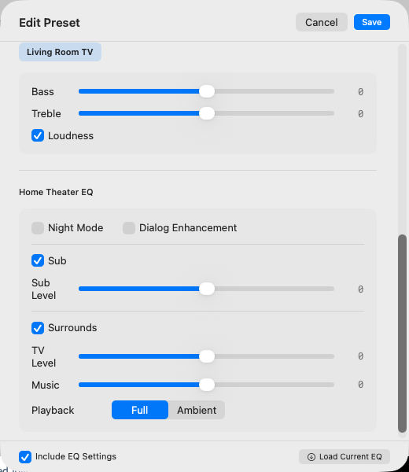
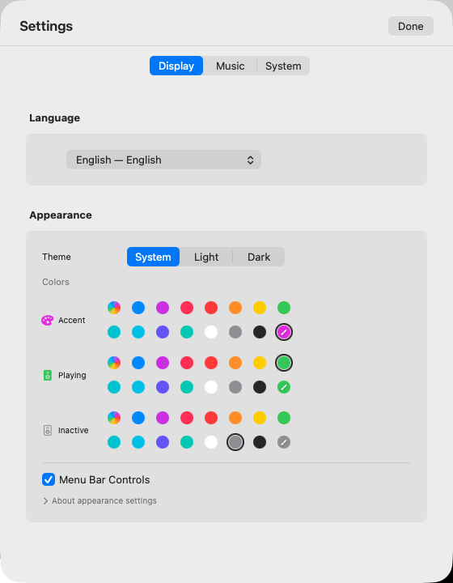

# The SonosController

A native macOS controller for Sonos speakers. Built entirely in Swift and SwiftUI. Ships as a universal binary with native support for both Apple Silicon and Intel Macs.

> **Looking for internals?** See [technical_readme.md](technical_readme.md) for architecture, protocols, build instructions, and contributor notes.



---

## Why This Exists

Sonos shipped a macOS desktop controller for years, but it was an Intel-only (x86_64) binary that relied on Apple's Rosetta 2 translation layer. Apple is discontinuing Rosetta, which means the official Sonos desktop app will stop working on modern Macs — and Sonos appears to have no plans to release a native replacement.

This project was built from scratch by a Sonos fan who wanted to keep controlling their speakers from their Mac. It is not affiliated with, endorsed by, or derived from Sonos, Inc. in any way. No proprietary Sonos code, assets, or intellectual property were used. The app communicates with speakers using the open UPnP protocols that any device on your local network can see and use. All control happens locally — nothing is sent to the cloud.

Tested against a live Sonos system with 16 speakers across 10 zones, a large local music library (45,000+ tracks), and multiple streaming services (Apple Music, Spotify, TuneIn, Calm Radio, Sonos Radio).

---

## What's New in v3.6

- **Last.fm scrobbling** — new Scrobbling tab in Settings. Register your own Last.fm API app (BYO — no bundled credentials, no shared quota), paste the API key + shared secret, connect via the browser-based approval flow. Submissions come entirely from the local play-history table — no additional network traffic to your speakers. Filter by room and music service; a Filter Preview disclosure shows exactly what would send and what's blocked (with sample rows) so "why isn't this scrobbling?" has an answer without log-diving. Auto-scrobble every 5 minutes is opt-in; manual "Scrobble Pending Now" is always available.
- **Scroll-wheel volume + middle-click mute** — scroll on the selected speaker to adjust volume (300 ms debounced so rapid flicks don't stack SOAP calls), middle-click to toggle mute.
- **Unified Keychain store** — all credentials (SMAPI tokens + Last.fm API app + session keys) live in one Keychain item with automatic migration from the old per-service locations. Result: one "Always Allow" prompt per rebuild instead of one per credential.
- **Music-service filter fixed** — the scrobbling filter's service matcher now uses authoritative Sonos service IDs (confirmed by a live `ListAvailableServices` probe): Apple Music (sid=204), Spotify (12), TuneIn (254), SoundCloud (160), Sonos Radio (303), Calm Radio (144), YouTube Music (284), Amazon Music (201). Previous guesses were silently dropping matches for several services.
- **Radio streams now scrobble** — tracks with `duration=0` (Sonos's value for continuous streams) are treated as unknown-duration and passed to Last.fm, which applies its own rules.
- **Paste restored in Settings** — ⌘V in the credential text fields works again.
- **Service-status matrix in the README** — the Music Services section now says which services this app can drive directly vs. which are locked to Sonos's own apps (Apple Music as SMAPI, Amazon Music, YouTube Music, SoundCloud — confirmed by live probe).

## What's New in v3.5

- **Sonos S1 + S2 coexistence** — legacy S1 speakers and modern S2 speakers on the same network now show up together in the sidebar, grouped by system with a horizontal divider. If you only have one system, nothing changes.

  

- **Stable multi-household rescans** — speakers no longer flicker in and out of the sidebar during periodic rescans, even when different speakers in the same household briefly return slightly different topology views. Room sections stay put.
- **Stable radio artwork** — album art on radio streams no longer flashes back to the station logo between tracks or while paused.
- **In-app Help** — `Help → SonosController Help` (⌘?) opens a built-in help window with eight topics, including a searchable keyboard-shortcuts reference.
- **Check for Updates** — `SonosController → Check for Updates…` queries the project's GitHub releases and tells you when a new version is available. A quiet background check runs at most once a day at launch.
- **Better macOS menus** — new Controls menu (⌘P play/pause, ⌘→ next, ⌘← previous, ⌥⌘↓ mute), new View menu items (⌘B browse, ⌥⌘U queue, ⇧⌘S stats), and a proper About panel with version info and a link to the project repo.
- **Main volume slider respects your accent colour** — the master volume slider now reliably reflects the custom accent colour you set in Settings, matching the per-speaker sliders.
- **First-run welcome** — a one-time popup on first launch points you to the official Sonos app for speaker and service setup, then to Settings → Music for enabling services in this app.
- **Localized UI for v3.5 additions** — menus, update-check dialogs, the About panel, Help topic titles, and the welcome popup are all translated across the 13 supported languages.

Earlier highlights from v3.0 — v3.1 (music services, listening stats, star/favourite tracks, artwork management, menu-bar redesign) are still covered below.

For the full per-release history, see [CHANGELOG.md](CHANGELOG.md).

---

## Features

### Now Playing, Browse, and Queue


The main view shows three panels: **Browse** (left), **Now Playing** (centre), and **Queue** (right). All three are togglable from the toolbar. The Now Playing panel is guaranteed a minimum width of 640 px — the side panels shrink proportionally when the window is resized.

**Now Playing** shows album art with automatic artwork resolution from multiple sources (speaker metadata, iTunes Search, manual override). Right-click the artwork to search for alternative art, ignore incorrect art, or refresh. The service tag (Spotify, Radio, Music Library, etc.) shows the source at a glance.

**Star any track** — click the star icon next to Copy Track Info to star the currently playing track. Works for any source: queue tracks, radio streams, Spotify, Apple Music — any track where metadata is available. Starred tracks are saved locally and can be filtered in the listening history. Star and unstar from Now Playing or the menu-bar mini player.

**Copy Track Details** copies the current track's metadata to the clipboard in a clean format:

```
Artist: Lofi Girl
Album: Lofi Girl x Assassin's Creed Shadows - stealthy beats to relax to
Track: A Moment of Sweetness - Prithvi Remix
```

Useful for sharing, logging, or searching another platform.

**Playback controls** — play, pause, stop, skip, seek with a draggable slider and smooth position interpolation. Shuffle, repeat (off / all / one), crossfade, sleep timer. Pause-all / Resume-all from the toolbar menu.

**Volume** — master slider covers the whole group (proportional or linear mode). Individual per-speaker sliders with drag protection. Mute toggle per speaker and master. Bass, treble, loudness, and Home Theater EQ (sub/surround levels, night mode, dialog enhancement) via the EQ panel.

**Scroll-wheel + middle-click** *(v3.6)* — hover over the Now Playing view and scroll the mouse wheel to adjust the master volume of the selected speaker. Middle-click anywhere on the view toggles mute. Discrete steps, debounced so rapid flicks don't spam the speaker with SOAP calls.

### Browse & Library

The Browse panel provides access to your entire music library and connected services:

- **Service Search** — Apple Music, TuneIn, Calm Radio, Sonos Radio, Spotify (individually toggleable in Settings)
- **Sonos Favorites & Playlists** — everything you've set up in the Sonos app
- **Local Library** — NAS/network music library with artists, albums, tracks, genres, composers, folder browsing
- **Recently Played** — quick access to tracks from your listening history
- **Search** — local library search across artists, albums, and tracks
- Play now, play next, add to queue, replace queue from the context menu
- Drag tracks from Browse directly into the Queue

### Queue

The Queue panel shows the current play queue with album art, track info, and duration. Tap to jump to a track, drag to reorder, right-click to remove. Queue shuffle physically reorders the tracks. Save the current queue as a Sonos playlist.

### Music Services

Services are managed in **Settings → Music**. Each can be individually enabled.

#### Available — No Connection Required

| Service | Browse | Search | Playback | Notes |
|---------|:------:|:------:|:--------:|-------|
| **Local Music Library** | ✓ | ✓ | ✓ | NAS / network shares via UPnP |
| **Sonos Favorites** | ✓ | — | ✓ | Favorites set up in the Sonos app |
| **Sonos Playlists** | ✓ | — | ✓ | Playlists saved from queues |
| **TuneIn** | ✓ | ✓ | ✓ | Public RadioTime API, no login needed |
| **Calm Radio** | ✓ | — | ✓ | Public API, no login needed |
| **Apple Music** | — | ✓ | ✓ | Search via iTunes API. Playback requires Apple Music connected in the Sonos app and one favorited song — this lets the app discover your account credentials. Once set up, all search results are directly playable |
| **Sonos Radio** | — | ✓ | ✓ | Search via anonymous SMAPI. Category browsing requires DeviceLink auth (not yet supported) |

#### Available — Connection Required (Tested)

| Service | Browse | Search | Playback | Notes |
|---------|:------:|:------:|:--------:|-------|
| **Spotify** | ✓ | ✓ | ✓ | AppLink authentication. Connect in Settings, then add one favorited song via the Sonos app |
| **Plex** *(v3.7)* | ✓ | ✓ | ✓ | AppLink authentication via [app.plex.tv/auth](https://app.plex.tv/auth). Streams from your own Plex Media Server — no third-party CDN, no short-lived signatures |

#### Available — Connection Required (Untested)

40+ additional services are available via SMAPI AppLink/DeviceLink and may work — connect via **Settings → Music → Other Services**. Results are not guaranteed.

#### Not Available

Confirmed by live probe against the Sonos `ListAvailableServices` + `getAppLink` endpoints (2026-04-24). These services ship encrypted API keys in their Sonos manifest (`cf.ws.sonos.com/p/m/<uuid>`) that only Sonos's app and speaker firmware can decrypt — third-party clients receive `403 / NOT_AUTHORIZED` from the SMAPI endpoint before auth can begin.

| Service | SID | Response | Workaround |
|---------|:---:|----------|------------|
| **Apple Music** (as SMAPI service) | 204 | `SonosError 999` | iTunes Search API fallback already used for search |
| **Amazon Music** | 201 | Same class of Sonos-identity gate | — |
| **YouTube Music** | 284 | GCP `403 PERMISSION_DENIED` (no API key) | — |
| **SoundCloud** | 160 | `Client.NOT_AUTHORIZED` (403) | Scrobbling of SoundCloud listens via the Sonos app works |
| **Sonos Radio browsing** | 303 | Category browsing requires DeviceLink (search works) | — |

**Scrobbling remains possible for all services above** — play history is recorded from whatever the Sonos app plays, regardless of whether this app can directly browse/search that service.

### Listening History



The **Dashboard** shows your listening patterns at a glance: total plays, hours listened, unique artists and rooms. Quick stat pills show your current streak, best streak, average plays per day, unique albums, stations, and starred-track count. Charts show listening activity over time, peak hours, and day-of-week distribution.



The **History** timeline groups tracks by day with album art, artist, album, service-source badge, room, and duration. Starred tracks show a star icon. Tracks from radio streams show the station name and service badge (Sonos Radio, TuneIn, etc.). Filter by date range, room, source, or search text. Starred-only filter shows just your favourites.



**Right-click any track** in the history to:

- **Star / Unstar** — mark tracks as favourites
- **Copy Track Details** — copies formatted metadata (Artist, Album, Track, Station) to clipboard
- **Copy Title / Copy Artist** — copy individual fields
- **Filter by artist, room, or source** — instantly filter the history view

**Last.fm scrobbling** *(v3.6)* — listening history doubles as the source for Last.fm scrobbling. Everything is submitted from the local SQLite table, not by tapping the speakers again; filter by room and music service so you can (for example) scrobble only what plays in the office, excluding the kids' bedroom. See the **Scrobbling** tab in Settings — fully documented in [What's New in v3.6](#whats-new-in-v36) above.

### Menu Bar Mode



Control playback without switching apps. The menu-bar mini player shows album art with a blurred background, track title, artist, and room. Transport controls (skip, play/pause, skip), volume slider with mute toggle, and a star button for the currently playing track. The room picker shows green/grey dots for playing status across zones. Click *Open SonosController* to bring up the main window.

### Speaker Presets



Save and recall speaker-group configurations with per-speaker volumes. Optionally include EQ settings (bass, treble, loudness, home-theatre sub/surround levels). One-click Apply to instantly reconfigure your speakers.



The preset editor shows all EQ controls including Home Theater settings: Night Mode, Dialog Enhancement, Sub level, Surround level, TV/Music balance, and Full/Ambient playback mode.

### Settings



Settings are organised into four tabs:

- **Display** — Language (13 languages), theme (System / Light / Dark), custom colours for accent / playing zone / inactive zone icons, menu-bar controls toggle
- **Music** — Playback options (Classic Shuffle, Proportional Group Volume), Play History toggle with stats, Music Services management (enable search services, connect Spotify, service status)
- **Scrobbling** *(new in v3.6)* — Connect Last.fm (BYO API app — register at [last.fm/api/account/create](https://www.last.fm/api/account/create), paste your key + shared secret, approve via browser). Filter which rooms and music services to scrobble, run on demand or auto-scrobble every 5 minutes. Includes a Filter Preview diagnostic showing why specific pending tracks aren't going through, and a Recent Non-Scrobbled list surfacing Last.fm's per-track rejections.
- **System** — Communication mode (Event-Driven / Legacy Polling), Startup mode (Quick Start / Classic), image-cache controls (size limit, age limit, clear)

### Privacy & Local-Only Operation

- **No accounts, no cloud.** The app talks directly to your speakers on your LAN.
- **No telemetry.** No analytics, no crash reporting, no usage tracking.
- **Tokens stay in Keychain.** When you connect a service like Spotify, the auth tokens live in macOS Keychain, protected so they can't be copied to another device.
- **App sandbox.** The app runs with minimal entitlements — network only. It can't read your files, contacts, or other apps.
- **All history stays on your Mac.** Listening history is a local SQLite file. You can clear it at any time from Settings.

---

## Requirements

- macOS 14.0 (Sonoma) or later
- Apple Silicon Mac (M1+) or Intel Mac
- Sonos speakers on the same local network

## Installation

1. Go to [Releases](../../releases) and download the latest `SonosController.zip`.
2. Unzip and drag `SonosController.app` to your Applications folder.
3. **First launch:** right-click the app and click *Open*, then click *Open* in the dialog (required once because the app is not notarized).
4. macOS will ask to allow local-network access — click Allow.

Building from source? See [technical_readme.md](technical_readme.md#building-from-source).

---

## Known Limitations

- **Apple Music** — search works via the iTunes API; playback requires Apple Music connected in the Sonos app plus one favorited song.
- **Sonos Radio** — search works anonymously; browsing categories requires DeviceLink auth (not yet supported).
- **Amazon Music / YouTube Music** — blocked (they require native OAuth flows that aren't available to third-party apps).
- **Adding to Favorites** — requires the official Sonos app (the UPnP `CreateObject` action is not supported by Sonos firmware).
- **Alarms** — Sonos S2 uses a cloud API; the local UPnP `AlarmClock` service returns empty.

## License

MIT License — see [LICENSE](LICENSE). Copyright © 2026.

## Disclaimer

This project is not affiliated with, endorsed by, or connected to Sonos, Inc. or any of the music service providers referenced in this software. All trademarks are the property of their respective owners: "Sonos" and "Sonos Radio" are trademarks of Sonos, Inc.; "Spotify" is a trademark of Spotify AB; "Apple Music" and "iTunes" are trademarks of Apple Inc.; "Amazon Music" is a trademark of Amazon.com, Inc.; "YouTube Music" is a trademark of Google LLC; "TuneIn" is a trademark of TuneIn, Inc.; "TIDAL" is a trademark of Aspiro AB; "Deezer" is a trademark of Deezer SA; "SoundCloud" is a trademark of SoundCloud Limited; "iHeartRadio" is a trademark of iHeartMedia, Inc.; "Plex" is a trademark of Plex, Inc.; "Calm Radio" is a trademark of Calm Radio Ltd.

This software is an independent, fan-built controller that communicates with Sonos hardware using standard UPnP protocols. No proprietary code, assets, or intellectual property from any of these companies was used. Use at your own risk.
